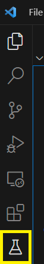
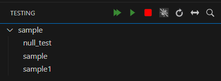
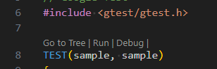

# Google Test Sample

テストコードはGo言語同様に`*_test.cpp`であること。

## Extension

- GoogleTest adapter
  - [MarcketPlace](https://marketplace.visualstudio.com/items?itemName=DavidSchuldenfrei.gtest-adapter)
  - [Github](https://github.com/DavidSchuldenfrei/gtest-adapter)

## 使い方

### GoogleTestを導入したバイナリを作成する

`TEST`マクロを使ったテストコードをバイナリにする。  
当然、`TEST`マクロ内でテストしたい関数やクラスもリンクされている必要がある。

### テスト実行

ペインから`testing`を選択する。

`←→`ボタンを押して、タスクを指定する。  
リロードボタンをテストマクロから生成されたテストシンボルを読み取る。

目的の関数のみを実行する。

