# 解説

## ビルド

```console
$ docker compose build --no-cache
[+] Building 0.0s (0/1)
[+] Building 1.1s (6/6) FINISHED
[+] Building 34.5s (11/11) FINISHED
```

## 起動

```console
$ docker compose up -d
[+] Running 2/2
 ✔ Container postgres-builder-1  Started   1.3s
 ✔ Container postgres-db-1       Started   1.0s
```

## デバッグ

```console
$ docker compose exec -it builder /bin/bash
dockeruser@builder(10.10.30.2 10.10.10.3):/code make all
```

VScodeを使う場合、remote-containerプラグインによってコンテナに接続する。  
F5デバッグ、コードジャンプなども可能。

## PostgreSQLサーバーへのログイン



### ポート番号の確認

WSL上でポート番号を確認する。

```console
$ ss -tnl
State    Recv-Q   Send-Q   Local Address:Port    Peer Address:Port   Process
LISTEN   0        511          127.0.0.1:37021        0.0.0.0:*             
LISTEN   0        4096                 *:5432               *:*             
```

> - -t: TCPのみ
> - -n: ポート番号のまま表示
> - -l: listenしているポート

ポート番号

```console
$ nmap -p 5432 localhost
Starting Nmap 7.80 ( https://nmap.org ) at 2023-08-20 23:23 JST
Nmap scan report for localhost (127.0.0.1)
Host is up (0.000056s latency).

PORT     STATE SERVICE
5432/tcp open  postgresql

Nmap done: 1 IP address (1 host up) scanned in 0.02 seconds
```

### コンテナに直接入る方法

```console
$ docker compose exec -it db psql -h 0.0.0.0 -p 5432 -U postgres
psql (15.3)
Type "help" for help.

postgres=#
```

### DBeaverなどでホストから入る場合

ホスト環境のポート番号5432へポートフォワードしているためホスト環境にインストールされているものと同様の方法で接続可能
