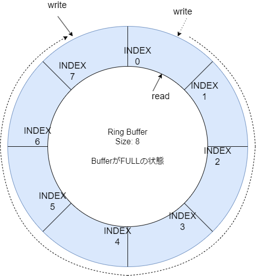
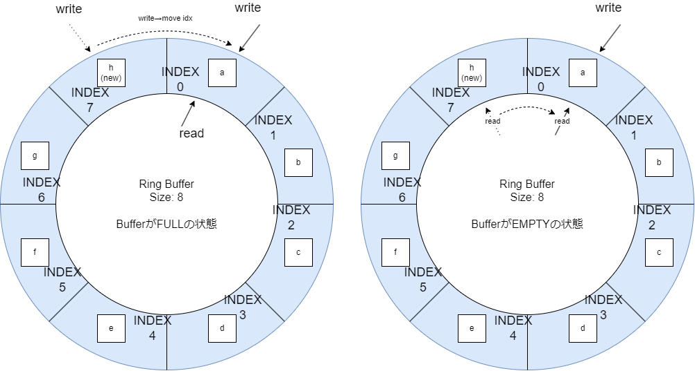

# リングバッファ解説

## 初期状態

## いっぱいの状態

write_idxが一周した状態。

判断する方法としては、

### 表現方法１：idxをサイクリックする

write_idxがbuffer_sizeを超えたことで判断する。  
その場合に、write_idxを0に戻すことで一周したことを表現できる。  

#### 問題点：FULLとEMPTYの区別が付かない

FULLとはwrite_idxがインクリメントされてread_idxへ追いついたときを示し、  
EMPTYはread_idxがインクリメントされてwrite_idxへ追いついたときを示す。

その瞬間のリングバッファの状態は、FULLの状態とEMPTYの状態が同じとなってしまい、判断が付かない。  
結局、操作履歴をフラグ変数などで残さなければならない。  

### 表現方法２：idx++

write_idxとread_idxの両方とも、インクリメントしかしない。  
両変数の差分だけでFULLとEMPTYを判断する。

write_idxとread_idxが一致する場合、どんな操作が行われたかは重要ではなく、その状態こそがEMPTYを表現する。  
write_idxとread_idxの距離がbuffer_sizeと一致する場合、バッファを一周してしまったことを表すため、その状態こそがFULLを表現する。

### 問題点

idxがバッファサイズよりも大きくなっていくためモジュロ演算（剰余算）をする必要がある。  
モジュロ演算は一見難しいが、変数のサイクリックをメモリに保存するのではなく、使用時に演算しようというだけである。

### 問題点：オーバーフロー

idx変数をインクリメントしかしないのでオーバーフローの問題がある。  
システムを停止メンテナンスする場合は0スタートとなる。  
また、仮に無停止システムだとしても64bitの場合、毎秒40億回dequeueに成功し続けてもオーバーフローするのは126年後とかである。
