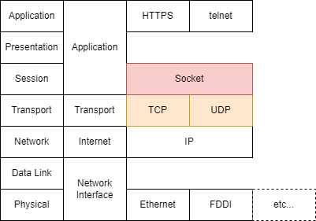

# Socketプログラミング

参考：

- [ソケットの基本](http://software.aufheben.info/contents.html?contents_key=kouza_socket01)
- [調べなきゃ寝れない！と調べたら余計に寝れなくなったソケットの話](https://qiita.com/kuni-nakaji/items/d11219e4ad7c74ece748)

## ソケットの種類

|プロトコル|TCP/IP|特定方法|制約|
|:----------:|:------:|:-------:|:--|
|INET4 Domain|TCP, UDP|IPv4 + Port|ネットワーク上のホストとのIPC|
|INET6 Domain|TCP, UDP|IPv6 + Port|ネットワーク上のホストとのIPC|
|Unix  Domain|TCP, UDP|/dev/xxx|同一ホスト上のIPC|



### INET4 Domain

IPv4でソケット通信を行う。  
IPv4アドレスとポート番号で相手を特定する。  
IPヘッダを付与するし、TCPヘッダも付与するので通信データ多くなる。  
ともしたら輻輳制御までしてるかもしれない。  
当然、処理速度はネットワークの速度に律速する。

### INET6 DOmain

INET4 Domainと基本は同じ。  
裏側ではIPv4より強化されたセキュリティ処理が動いてるのでINET4よりも重たいと思われる。

### Unix Domain

同一のUnixの中で通信されるIPC。  

- pros
  - ポート番号を消費しない
  - etc...
- cons
  - 同一マシン上でのプロセス間でしか通信できない
  - スループットが高速

> [Performance Analysis of Various Mechanisms
for Inter-process Communication](http://osnet.cs.binghamton.edu/publications/TR-20070820.pdf)  
> It was hypothesized that pipes would have the highest throughput due to its limited functionality, since it is half-duplex, but this was not true. For almost all of the data sizes transferred, Unix domain sockets performed better than both TCP sockets and pipes, as can be seen in Figure 1 below.  
> On some machines, Unix domain sockets reached transfer rates as high as 1500 MB/s.

以下の３つが存在する

- ファイルシステムパス名
- 無名
- 抽象名前空間

#### ファイルシステムパス名

一番一般的な手法。  
[bind(2)](http://linuxjm.osdn.jp/html/LDP_man-pages/man2/bind.2.html)を使用して、NULL終端(\0)されたファイルシステム上のパスに結びつけることができる。  
ファイルを使用しているため、パーミッションを調整する必要がある。  
サーバプロセスが終了するときには、[unlink(2)](http://linuxjm.osdn.jp/html/LDP_man-pages/man2/unlink.2.html)で名前を削除し、場合によってはそれが参照しているファイルも削除するのがお作法。

#### 無名

[bind(2)](http://linuxjm.osdn.jp/html/LDP_man-pages/man2/bind.2.html)を使ってパス名に結び付けることができないストリーム型のソケットは名前を持たない。  
[socketpair(2)](http://linuxjm.osdn.jp/html/LDP_man-pages/man2/socketpair.2.html)を使うと、名前のついていない CONNECTED なソケットのペアが生成される。  
[fork(2)](https://linuxjm.osdn.jp/html/LDP_man-pages/man2/fork.2.html)してFDを繋ぎ直してあげれば、[pipe](https://linuxjm.osdn.jp/html/LDP_man-pages/man2/pipe.2.html)で実現するのと同じような双方向のプロセス間通信ができる。

#### 抽象名前空間

sun_pathにファイルシステムのパスではなく、NULLバイト(\0)であることで区別される。  
NULLバイト以降に名前(文字列)を渡すが、ファイルパス名とは関係ない。  
ファイルシステムと紐付いていないので、 ファイルシステムのパーミッションなどに関係なくソケット通信できてしまう。  
Linuxでのみ利用可能。[unlink(2)](http://linuxjm.osdn.jp/html/LDP_man-pages/man2/unlink.2.html)で終了する必要がない。

## そもそもソケットとは

ソケットとは日本語のコンセントのようなものである。  

## 関数のイメージの説明

あくまでイメージ。

- `socket()` コンセントを設置する関数
- `bind()` コンセントの裏を配線する
- `listen()` コンセントからタコ足を繋ぐ
- `fork()` コンセントを刺す。他の穴を塞がないようにする
- `waitpid()` コンセントを抜く。
- `unlink` コンセント裏の配線を解体する
- `close()` コンセントを取り除く

## ソケット通信の制御

### マクロ処理

|マクロ|処理|意味|
|:--:|:--|:--|
|`FD_ZERO(&fds)`|集合を空にする|初期化|
|`FD_SET(fd, &fds)`|集合内のFDビットを1にする|集合に追加する|
|`FD_CLR(fd, &fds)`|集合内のFDビットを0にする|集合から除外する|
|`FD_ISSET(fd, &fds)`|集合内のFDビットを確認する|FDが集合に含まれているかを確認する|

### FD集合

`fd_setとは以下の構造体で定義されている。  

```c++
// select.h
typedef struct {
    long int fds_bits[16];
} fd_set;
```

64bit Linuxでは`long`型は64bitであることから、64bit * 16要素 = 1024要素。  
よって、64bit Linuxでは1ポート1024個のFDを管理できる。

`FD_SET`マクロの処理だが、

```c++
// x86_64-linux-gnu/sys/select.h
#define FD_SET(fd, fdsetp) __FD_SET (fd, fdsetp)
#define FD_CLR(fd, fdsetp) __FD_CLR (fd, fdsetp)
#define FD_ISSET(fd, fdsetp) __FD_ISSET (fd, fdsetp)
#define FD_ZERO(fdsetp)  __FD_ZERO (fdsetp)
// x86_64-linux-gnu/bits/select.h
#define __FD_SET(d, set) \
  ((void) (__FDS_BITS (set)[__FD_ELT (d)] |= __FD_MASK (d)))
#define __FD_CLR(d, set) \
  ((void) (__FDS_BITS (set)[__FD_ELT (d)] &= ~__FD_MASK (d)))
#define __FD_ISSET(d, set) \
  ((__FDS_BITS (set)[__FD_ELT (d)] & __FD_MASK (d)) != 0)
// マクロ地獄なので展開すると
fdsetp->fds_bits[fd/64] |= (__fd_mask) (1UL << (fd % 64));
```

## Tips

TIME_WAIT状態は、同一ポートを別プロセスが利用するのを防ぐためにTCP規格で規定されている。  
TIME_WAIT状態のポートと同一のポートをbindしようとすると、bindは失敗してしまう。  
それをケアするのが`SO_REUSEADDR`オプションである。
