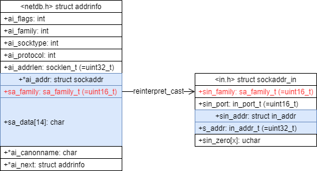

# struct addrinfo構造体について

`struct addrinfo`構造体は、`getadrinfi()`関数によって巣取得できる情報である。  
これは、特定のホスト名やサービス名に関するネットワークアドレスの複数の可能性を表現している。

以下が具体的な定義である。

```c
struct addrinfo
{
  int ai_flags;             /* Input flags.  */
  int ai_family;            /* Protocol family for socket.  */
  int ai_socktype;          /* Socket type.  */
  int ai_protocol;          /* Protocol for socket.  */
  socklen_t ai_addrlen;     /* Length of socket address.  */
  struct sockaddr *ai_addr; /* Socket address for socket.  */
  char *ai_canonname;       /* Canonical name for service location.  */
  struct addrinfo *ai_next; /* Pointer to next in list.  */
};
```



## リンクリストである意味

ネットワークアドレスが複数である可能性のためリンクリストとして無限長な仕組みが採用されいてる。  
ネットワークアドレスが複数とはどういうことか？

### IPv4とIPV6両方を対応したサービスである可能性

ホスト`example.com`をDNSした結果、IPv4とIPv6の両方を持つケースが一つ考えられる。

アプリケーションは、この複数の中から最適なアドレス情報を選択することが必要だったりもする。  
たとえば、IPv6で接続された場合には、IPv6のアドレスを優先して返すなどが考えられる。

### ポート番号が複数採用されている可能性

`example.com`のサービスが複数のポート番号で展開されているケースが一つ考えられる。

ポート番号が8080と8081で展開されていて、優先的なアクセスは8080だとする。  
その場合、アプリケーションはアクセス元から最適なポート番号を選択する必要があるかもしれない。
